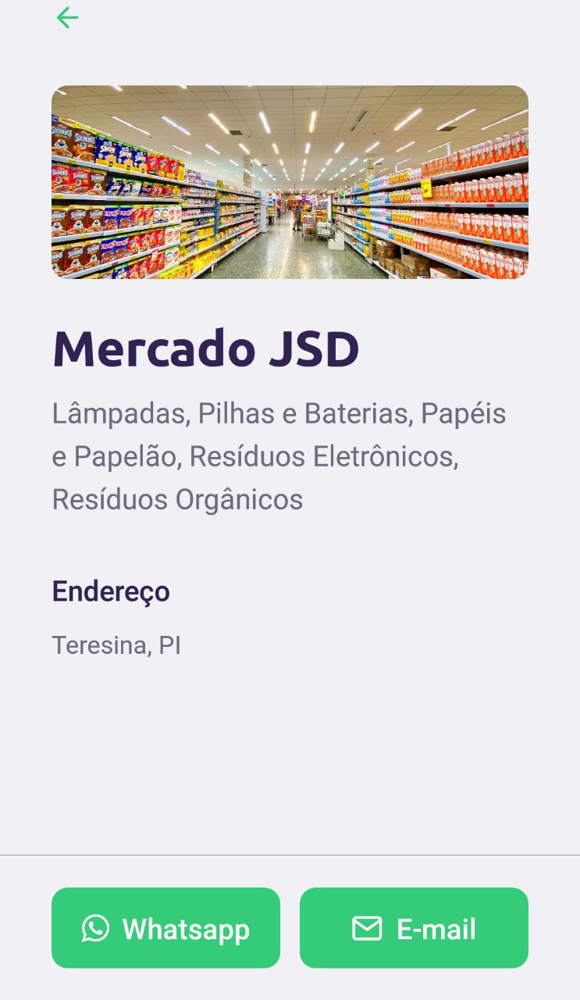

# Next Level Week

O NLW é uma semana prática com muito código, desafios, networking e um único objetivo: te levar para o próximo nível. O projeto é desenvolvido pela Rocketseat e inspira o aluno a avançar em seus objetivos. 

# Descrição 

O projeto desenvolvido na NLW foi o Ecoleta, uma plataforma de cadastro e pesquisa de pontos para reciclagem de resíduos. O objetivo era desenvolver tanto o back end da aplicação com NodeJS(Rest API) quando suas versões web(React) e mobile(React Native) integradas com o Typescript. Para o projeto mobile foi utilizado o expo como base de desenvolvimento.

# Como o projeto está atualmente

## Web - React com TypeScript

## Mobile - React Native com TypeScript

  
  
  

# Implementações Futuras

## Web - React com TypeScript

- [ ] Adicionar tela de sucesso ao cadastrar um novo ponto de coleta;

- [ ] Adicionar tela de busca de pontos de coleta.

## Mobile - React Native com TypeScript

- [ ] Implementar filtragem por cidade e estado a busca de pontos de coleta.